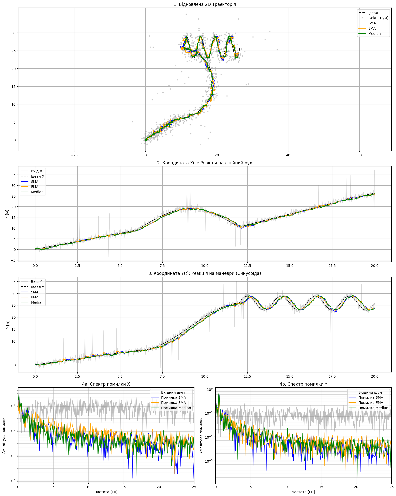
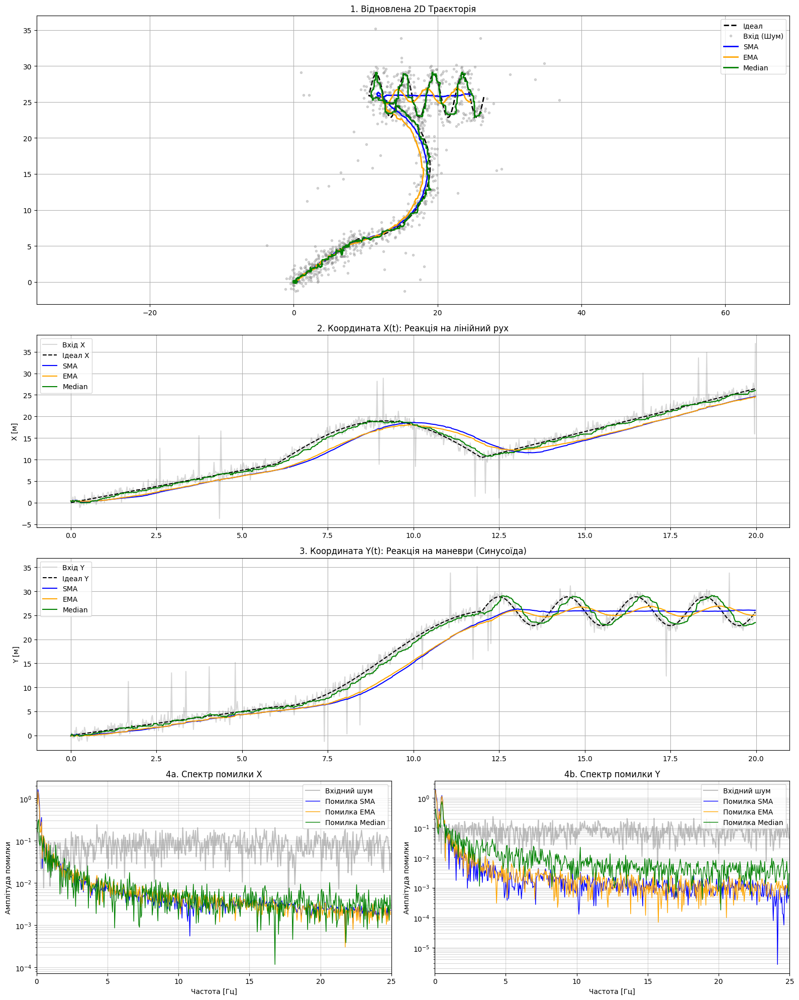

# Обробка координатних даних: Придушення шумів у потоці (Real-time)
## Бучко Вікторія ІПЗ-4.02
 
---
 
## Мета
- Реалізувати програмну архітектуру для потокової (real-time) обробки координатних даних
- Імплементувати три типи цифрових фільтрів: SMA, EMA та Median Filter
- Дослідити компроміс між якістю фільтрації (гладкістю) та динамічними спотвореннями (затримкою/lag)
- Провести спектральний аналіз помилки фільтрації
---
 
## Реалізація
 
У класах фільтрів реалізовано методи update, які імітують роботу в real-time режимі - кожен новий вимір обробляється окремо, без доступу до майбутніх точок
 
### SMA (Simple Moving Average)
Лінійний фільтр із ковзним вікном. Реалізовано з оптимізацією O(1) через підтримку поточної суми:
 
```python
def update(self, x):
    if len(self.q) == self.w:
        self.sum -= self.q[0]
    self.q.append(x)
    self.sum += x
    return self.sum / len(self.q)
```
 
### EMA (Exponential Moving Average)
Рекурсивний фільтр, який зберігає лише одне попереднє значення:
 
```python
def update(self, x):
    if self.last is None:
        self.last = x
    else:
        self.last = self.a * x + (1 - self.a) * self.last
    return self.last
```
 
### Median Filter
Нелінійний фільтр - повертає медіану поточного вікна спостережень:
 
```python
def update(self, x):
    self.q.append(x)
    return np.median(self.q)
```
 
---
 
## Експеримент 1 (Базовий)
 
**Параметри:** W_SMA = 20, A_EMA = 0.1, W_MED = 21
 

 
Рисунок 1 - Результати базового експерименту
 
### Аналіз результатів
 
Чи сильно лінії фільтрів відстають від чорного пунктиру (Ідеалу)?

На графіку 3 в ділянці 13–20 секунд усі три фільтри помітно відстають від чорного пунктиру. SMA і медіана мають вікно ~20–21 точка, що дає затримку близько 0.4 секунди. EMA з α=0.1 поводиться схоже — еквівалентне вікно теж близько 20 точок. На піках синусоїди всі лінії трохи "зрізають кути" і не встигають за ідеалом, але загалом відставання помірне і прийнятне.

Як медіанний фільтр впорався з поодинокими "викидами"?

Порівняйте з SMA.Медіанний фільтр практично не реагує на поодинокі різкі викиди — зелена лінія залишається рівною навіть там, де сірі точки різко стрибають вгору чи вниз. SMA натомість включає кожен викид в усереднення і "розмазує" його ефект на наступні 20 точок, через що на синій лінії після кожного стрибка помітне хвилеподібне спотворення.
 
---
 
## Експеримент 2 (Екстремальне згладжування)
 
**Параметри:** W_SMA = 100, A_EMA = 0.02, W_MED = 21
 

 
Рисунок 2 - Результати екстремального згладжування
 
### Аналіз спектру помилки (Графік 4b)
 
На спектрі помилки Y чітко видно **парадокс надмірного згладжування**:
 
- Права частина (>5 Гц, високі частоти): кольорові лінії знаходяться нижче сірої - шум успішно придушений.
- Ліва частина (0–1 Гц, низькі частоти): кольорові лінії піднімаються вище сірої лінії вхідного шуму.
### Пояснення феномену
 
Змійкова траєкторія має період 2 с (частота 0.5 Гц). SMA з вікном 100 точок усереднює дані рівно за 2 секунди (100/50 = 2 с) і запізнюється на 1 секунду (половина вікна). Це означає, що фільтр систематично "не встигає" за поворотами і відтворює не реальну позицію, а усереднену за минулі 2 секунди.
 
У результаті виникає помилка 3–5 метрів - **більша, ніж початковий шум 0.8 м**. На низьких частотах фільтр не прибирає похибку, а сам її створює через затримку. Це і є "горб" на лівій частині спектру.
 
**Висновок:** Надмірне згладжування (вікно ≥ періоду сигналу) шкодить більше, ніж допомагає - фільтр починає спотворювати саму траєкторію, а не лише шум.
 
---
 
## Експеримент 3 (Медіанний фільтр, мале вікно)
 
**Параметри:** W_SMA = 20, A_EMA = 0.1, W_MED = 5
 

 
Рисунок 3 - Результати з малим вікном медіанного фільтру
 
### Аналіз
 
Медіана з вікном 5 точок (0.1 с) швидше реагує на зміни траєкторії - затримка скорочується до ~0.05 с. Однак якщо викид триває ≥3 точки підряд, фільтр його пропускає (медіана вибирає середнє з 5 значень, тому потрібно мінімум 3 "нормальні" точки).
 
За гладкістю медіана W=5 порівнянна з SMA W=3–4, але значно краще справляється з поодинокими викидами. На спектрах 4a/4b зелена лінія розташована вище на частотах >10 Гц - ціна малого вікна - менше придушення високочастотного шуму.
 
---
 
## Висновок
 
**(а) Видалення збоїв сенсора (викидів):**
Найкраще справляється **медіанний фільтр**. Він повністю ігнорує поодинокі аномалії, оскільки завжди вибирає центральне значення відсортованого вікна. SMA та EMA розмазують кожен викид на всю довжину вікна, залишаючи хвилеподібні артефакти на траєкторії.
 
**(б) Плавне ведення траєкторії:**
Найкраще підходять SMA або EMA - вони дають ідеально гладку лінію без дрібних коливань. Медіанний фільтр може "стрибати" між сусідніми значеннями, особливо при малих вікнах.
 
**Практична рекомендація для GPS-навігації:** застосовувати медіану (W=11–21) для захисту від викидів, а потім легкий SMA (W=3–5) для фінального згладжування. Це дає найкращий баланс між стійкістю до аномалій і плавністю траєкторії.
